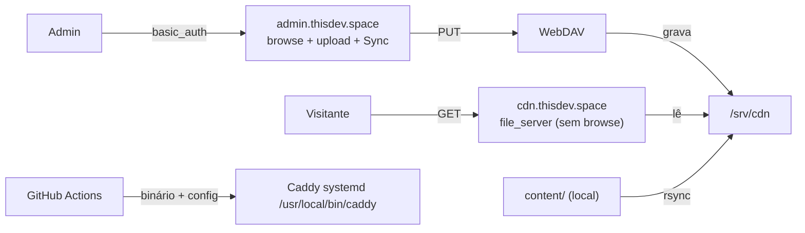

# cdn.thisdev.space

CDN própria de assets estáticos: **Caddy + plugin WebDAV**, deploy **nativo
(systemd)** numa VPS Debian. Código/config vem por **GitHub Actions**; o
conteúdo fica **fora do Git** e chega por `rsync` e/ou upload pela UI do admin.

## Arquitetura



- **`cdn.thisdev.space`** — entrega pública. `file_server` **sem** `browse`:
  diretórios retornam **404** (listagem fechada). Cache longo + `immutable`
  para arquivos com hash no nome; CORS liberado para assets.
- **`admin.thisdev.space`** — protegido por `basic_auth`. GET/HEAD servem uma
  listagem **custom** (`browse.html`) com: diagrama Mermaid (arquitetura),
  **upload drag-and-drop** (auto-refresh) e botão **Sync**. Demais métodos vão
  para o **WebDAV** (`PUT` grava em `/srv/cdn`).

## Estrutura do repositório

```
cdn/
├── Caddyfile                  # produção (cdn/admin.thisdev.space)
├── Caddyfile.dev              # local (:18080 público, :18081 admin)
├── browse.html                # template do admin (lista + upload + Sync + Mermaid)
├── devenv.nix / devenv.yaml   # dev local
├── content.example/           # amostra versionada da árvore servida
├── deploy/
│   ├── systemd/caddy.service
│   ├── sudoers.d/cdn-deploy
│   └── scripts/{setup-server.sh,remote-apply.sh,deploy-rsync.sh,gen-hash.sh}
├── docker/                    # OPCIONAL (Dockerfile + docker-compose.yml)
└── .github/workflows/deploy.yml
```

`content/` (real) e `.env` estão no `.gitignore`.

## Desenvolvimento local

Requer Nix + devenv.

```sh
devenv shell
cdn-build      # compila ./bin/caddy COM o plugin webdav (xcaddy)
cdn-seed       # content.example/ -> content/
cdn-dev        # http://localhost:18080 (público) e :18081 (admin)
```

No admin local (`:18081`) o `basic_auth` é omitido (só localhost). Teste:
`curl -i http://localhost:18080/css/` deve retornar **404** (listagem fechada).

Formatar/validar:

```sh
cdn-fmt
cdn-validate
```

## Bootstrap da VPS (Debian, nativa) — 1x

Pré-requisito: apontar os DNS `A` de `cdn.thisdev.space` e
`admin.thisdev.space` para o IP da VPS.

```sh
scp -r . root@<vps>:/root/cdn      # ou clone o repo no VPS
ssh root@<vps>
cd /root/cdn
DEPLOY_USER=lacon deploy/scripts/setup-server.sh
```

O script:

- instala pacotes (`ca-certificates curl rsync ufw apache2-utils`);
- cria usuário de sistema `caddy`, grupo `cdn-deploy` e os diretórios
  `/srv/cdn`, `/etc/caddy`, `/var/lib/caddy`, `/home/lacon/cdn`;
- instala a unit `caddy.service`, o helper `/usr/local/bin/cdn-apply` e a regra
  `sudoers.d/cdn-deploy`;
- gera `/etc/caddy/cdn.env` com **usuário/senha do admin** (senha aleatória,
  também salva em `/root/cdn-admin-credentials.txt`);
- libera `80/443/443udp` no `ufw`.

> A VPS **não** precisa de Go/xcaddy: o binário é compilado no CI.

## Deploy do código (GitHub Actions)

Push em `main` dispara o workflow (mesmo padrão do `spotify-in-github`), que:

1. compila o Caddy com o plugin `mholt/caddy-webdav@fa2f366…` (static, linux amd64);
2. copia `caddy` + `Caddyfile` + `browse.html` para `/home/lacon/cdn` via `appleboy/scp-action`;
3. roda `sudo /usr/local/bin/cdn-apply` (instala em `/usr/local/bin/caddy` + `/etc/caddy` e `reload`/`restart` o Caddy) via `appleboy/ssh-action`.

Configure o **environment `prod`** no GitHub com os secrets:

| Secret | Descrição |
|---|---|
| `VPS_HOST` | IP/host da VPS |
| `VPS_USER` | usuário com sudo (grupo `cdn-deploy`) — `lacon` |
| `VPS_SSH_KEY` | chave privada SSH (ed25519) |

O `.env`/hash do admin **fica apenas na VPS** e nunca vai para o CI.

## Publicar conteúdo (fora do Git)

Dois caminhos — nenhum deles versiona assets:

1. **rsync manual**
   ```sh
   export DEPLOY_HOST=lacon@<vps>
   deploy/scripts/deploy-rsync.sh            # envia content/ -> /srv/cdn
   ```
2. **UI do admin** — abra `https://admin.thisdev.space/`, arraste os arquivos
   na área de upload. O upload é gravado na pasta aberta e a listagem é
   atualizada automaticamente. O botão **Sync** relê a listagem (sem F5) quando
   você acabou de rodar um `rsync` local.

Não é preciso recarregar o Caddy para conteúdo: o `file_server` lê do disco.

## Arquivos grandes

- **Download:** streaming com `Range` (retomável), sem buffer em memória e sem
  limite de tamanho — o limite é o disco da VPS.
- **Upload WebDAV/UI:** gravado direto no disco, mas **não é retomável**. Para
  arquivos grandes (GB+), prefira `rclone`/`rsync`.
- Se usar Cloudflare na frente, mantenha `admin`/dav em **DNS-only** (o plano
  grátis limita upload a ~100 MB).

## Docker (opcional)

O caminho padrão é systemd. Se preferir Docker:

```sh
docker compose -f docker/docker-compose.yml up -d --build
```

## Manutenção

```sh
ssh lacon@<vps> sudo systemctl status caddy
ssh lacon@<vps> sudo systemctl reload caddy
journalctl -u caddy -f
```

Editar a senha do admin: gere o hash e atualize `/etc/caddy/cdn.env`.

```sh
deploy/scripts/gen-hash.sh 'nova-senha'    # copie para ADMIN_PASSWORD_HASH
ssh lacon@<vps> 'sudo /usr/local/bin/cdn-apply'
```
